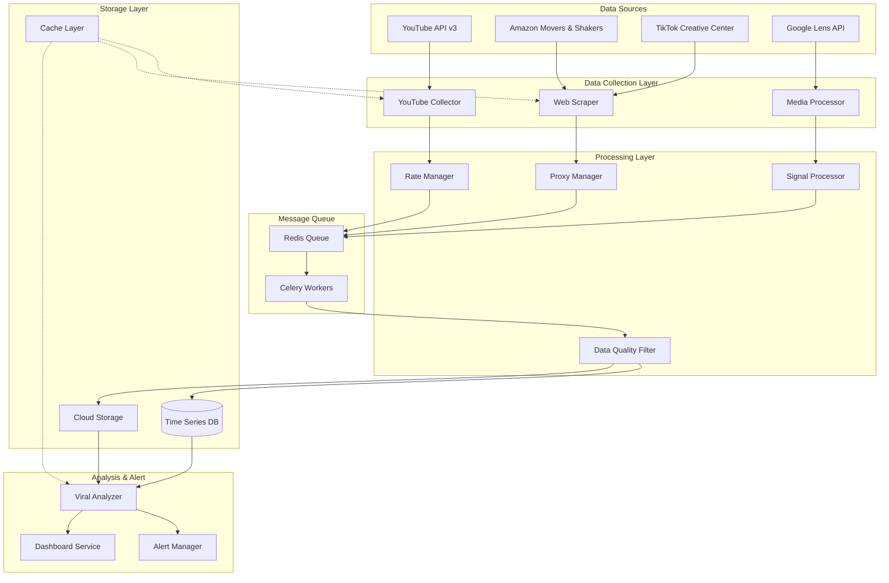

# 글로벌 바이럴 조기 경보 시스템 - 설계 문서

## 개요

글로벌 바이럴 조기 경보 시스템은 YouTube API, 웹 크롤링, 실시간 데이터 처리를 통해 K-Beauty 트렌드를 조기 감지하는 엔터프라이즈급 시스템입니다. 마이크로서비스 아키텍처와 이벤트 기반 처리를 통해 확장성과 안정성을 보장합니다.

## 아키텍처

### 전체 시스템 아키텍처



### 마이크로서비스 구성

1. **YouTube Collection Service**: YouTube API 기반 데이터 수집
2. **Web Scraping Service**: Amazon/TikTok 웹 크롤링
3. **Media Processing Service**: 영상/이미지 처리 및 분석
4. **Signal Processing Service**: 바이럴 신호 분석 및 점수 계산
5. **Alert Management Service**: 알림 생성 및 다중 채널 전송
6. **Dashboard Service**: 실시간 모니터링 및 시각화

## 컴포넌트 및 인터페이스

### 1. YouTube Collection Service

```python
class YouTubeCollector:
    def __init__(self, api_keys: List[str], rate_limiter: RateLimiter)
    
    async def search_videos(self, keywords: List[str]) -> List[VideoData]
    async def get_channel_activities(self, channel_ids: List[str]) -> List[ActivityData]
    async def get_video_statistics(self, video_ids: List[str]) -> List[StatisticsData]
    async def track_viral_velocity(self, video_id: str) -> ViralScore
```

**주요 기능:**
- YouTube Data API v3 통합
- 키워드 기반 영상 검색
- 인플루언서 채널 모니터링
- 조회수 증가 속도 추적
- API 할당량 관리 및 키 로테이션

### 2. Web Scraping Service

```python
class WebScraper:
    def __init__(self, proxy_manager: ProxyManager, browser_pool: BrowserPool)
    
    async def scrape_amazon_movers(self) -> List[ProductData]
    async def scrape_tiktok_trends(self) -> List[TrendData]
    async def handle_dynamic_content(self, url: str) -> BeautifulSoup
    async def adaptive_selector_update(self, site: str) -> SelectorConfig
```

**주요 기능:**
- Headless Browser 기반 동적 페이지 처리
- 프록시 로테이션 및 IP 차단 회피
- 적응형 셀렉터 자동 업데이트
- 사이트별 최적화된 크롤링 전략

### 3. Signal Processing Service

```python
class SignalProcessor:
    def __init__(self, ml_models: Dict[str, MLModel])
    
    async def calculate_viral_score(self, signals: List[Signal]) -> ViralScore
    async def detect_multi_platform_surge(self, brand: str) -> SurgeAlert
    async def analyze_arbitrage_opportunity(self, product_data: ProductData) -> ArbitrageData
    async def filter_noise_data(self, raw_data: List[RawData]) -> List[CleanData]
```

**주요 기능:**
- 바이럴 점수 계산 알고리즘
- 다중 플랫폼 신호 통합 분석
- 아비트라지 기회 탐지
- 노이즈 데이터 필터링

### 4. Rate Limiter & Proxy Manager

```python
class RateLimiter:
    def __init__(self, api_configs: Dict[str, APIConfig])
    
    async def acquire_permit(self, api_name: str) -> bool
    async def rotate_api_key(self, api_name: str) -> str
    def get_remaining_quota(self, api_name: str) -> int

class ProxyManager:
    def __init__(self, proxy_pool: List[ProxyConfig])
    
    async def get_proxy(self) -> ProxyConfig
    async def mark_proxy_blocked(self, proxy: ProxyConfig)
    async def rotate_user_agent(self) -> str
```

## 데이터 모델

### 핵심 데이터 구조

```python
@dataclass
class VideoData:
    video_id: str
    title: str
    channel_id: str
    channel_name: str
    view_count: int
    like_count: int
    comment_count: int
    published_at: datetime
    description: str
    tags: List[str]
    detected_keywords: List[str]
    korean_brands: List[str]

@dataclass
class ViralScore:
    video_id: str
    score: float  # 0-10
    velocity: float  # views per hour
    engagement_rate: float
    keyword_relevance: float
    brand_mentions: List[str]
    calculated_at: datetime

@dataclass
class ProductData:
    asin: str
    title: str
    brand: str
    price: float
    rank: int
    category: str
    movers_rank_change: int
    korean_brand_detected: bool
    
@dataclass
class TrendData:
    hashtag: str
    platform: str
    view_count: int
    post_count: int
    engagement_rate: float
    related_keywords: List[str]
    detected_at: datetime
```

### 데이터베이스 스키마

**시계열 데이터 (InfluxDB)**
```sql
-- 영상 통계 시계열
video_statistics,video_id=abc123,channel_id=xyz789 view_count=1000000,like_count=50000,comment_count=2000 1640995200000000000

-- 바이럴 점수 시계열  
viral_scores,video_id=abc123 score=8.5,velocity=10000.0,engagement_rate=0.05 1640995200000000000

-- 제품 랭킹 시계열
product_rankings,asin=B08XYZ,category=beauty rank=5,price=25.99,rank_change=-3 1640995200000000000
```

**관계형 데이터 (PostgreSQL)**
```sql
CREATE TABLE channels (
    channel_id VARCHAR(50) PRIMARY KEY,
    channel_name VARCHAR(255),
    subscriber_count BIGINT,
    is_beauty_influencer BOOLEAN,
    monitoring_enabled BOOLEAN,
    created_at TIMESTAMP DEFAULT NOW()
);

CREATE TABLE keywords (
    id SERIAL PRIMARY KEY,
    keyword VARCHAR(100) UNIQUE,
    category VARCHAR(50),
    priority INTEGER,
    is_active BOOLEAN DEFAULT TRUE
);

CREATE TABLE alerts (
    id SERIAL PRIMARY KEY,
    alert_type VARCHAR(50),
    severity VARCHAR(20),
    title VARCHAR(255),
    message TEXT,
    metadata JSONB,
    sent_channels TEXT[],
    created_at TIMESTAMP DEFAULT NOW()
);
```

## 정확성 속성

*속성은 시스템이 모든 유효한 실행에서 참이어야 하는 특성 또는 동작입니다. 속성은 사람이 읽을 수 있는 사양과 기계 검증 가능한 정확성 보장 사이의 다리 역할을 합니다.*

### Property 1: YouTube API 키워드 검색 정확성
*모든* YouTube API 검색 요청에 대해, 반환된 결과는 요청된 키워드 중 하나 이상을 제목이나 설명에 포함해야 합니다.
**검증: 요구사항 1.1**

### Property 2: 경쟁사 브랜드 메타데이터 수집 완성성
*모든* 경쟁사 브랜드 키워드가 감지된 영상에 대해, 시스템은 조회수, 좋아요 수, 댓글 수, 게시일, 설명 텍스트를 모두 수집해야 합니다.
**검증: 요구사항 1.2, 1.4**

### Property 3: 인플루언서 채널 실시간 감지 적시성
*모든* 사전 정의된 인플루언서 채널에서 신규 업로드가 발생한 경우, 시스템은 1시간 이내에 이를 감지해야 합니다.
**검증: 요구사항 1.3, 4.1**

### Property 4: 바이럴 점수 계산 일관성
*모든* 영상 통계 데이터에 대해, 동일한 입력값은 항상 동일한 Viral_Score를 생성해야 합니다.
**검증: 요구사항 1.6, 7.1**

### Property 5: Amazon 제품 파싱 정확성
*모든* Amazon Movers & Shakers 페이지에서, 파싱된 제품명과 브랜드명은 실제 페이지 내용과 일치해야 합니다.
**검증: 요구사항 2.2**

### Property 6: 동적 페이지 처리 완성성
*모든* Infinite Scroll이 있는 페이지에 대해, 시스템은 Headless Browser를 사용하여 모든 동적 콘텐츠를 로드해야 합니다.
**검증: 요구사항 2.5**

### Property 7: 프레임 캡처 형식 호환성
*모든* 캡처된 영상 프레임은 Google Lens API와 호환되는 이미지 형식(JPEG, PNG)으로 저장되어야 합니다.
**검증: 요구사항 3.2**

### Property 8: 링크 추출 정확성
*모든* 인플루언서 프로필과 영상 설명에서, Linktree와 Amazon Storefront 링크는 올바른 URL 패턴으로 식별되어야 합니다.
**검증: 요구사항 3.3, 3.4**

### Property 9: 비동기 처리 성능 보장
*모든* 수천 개의 키워드 처리 작업에 대해, 시스템은 AsyncIO를 사용하여 순차 처리 대비 최소 5배 이상의 성능 향상을 달성해야 합니다.
**검증: 요구사항 4.2**

### Property 10: API 할당량 보호
*모든* YouTube API 호출에 대해, Rate_Limiter는 일일 할당량의 95%를 초과하지 않도록 제한해야 합니다.
**검증: 요구사항 5.1**

### Property 11: 프록시 로테이션 효과성
*모든* IP 차단 감지 시, Proxy_Manager는 5초 이내에 다른 프록시로 전환하여 요청을 재시도해야 합니다.
**검증: 요구사항 5.4**

### Property 12: 중복 데이터 제거 정확성
*모든* 수집된 콘텐츠에 대해, 동일한 고유 ID(Video ID, ASIN)를 가진 데이터는 한 번만 저장되어야 합니다.
**검증: 요구사항 6.1**

### Property 13: 스팸 필터링 정확성
*모든* 알려진 스팸 패턴을 포함한 댓글은 시스템에서 자동으로 필터링되어야 합니다.
**검증: 요구사항 6.2**

### Property 14: 알림 임계값 정확성
*모든* Viral_Score가 설정된 임계값을 초과하는 경우, Alert_Manager는 즉시 알림을 발송해야 합니다.
**검증: 요구사항 7.2**

### Property 15: 다중 채널 알림 완성성
*모든* 발송되는 알림에 대해, 설정된 모든 채널(Slack, 이메일, SMS)로 성공적으로 전송되어야 합니다.
**검증: 요구사항 7.5**

### Property 16: 오토스케일링 반응성
*모든* 시스템 부하가 80%를 초과하는 경우, 시스템은 5분 이내에 추가 워커 인스턴스를 시작해야 합니다.
**검증: 요구사항 8.1**

### Property 17: API 토큰 자동 갱신
*모든* OAuth 토큰 만료 시, 시스템은 자동으로 토큰을 갱신하여 API 호출 중단을 방지해야 합니다.
**검증: 요구사항 9.1**

### Property 18: 데이터 검색 성능
*모든* 데이터 검색 요청에 대해, 시스템은 인덱싱을 통해 1초 이내에 응답해야 합니다.
**검증: 요구사항 10.3**

### Property 19: 백업 스케줄 준수
*모든* 일일 백업 작업은 설정된 시간(예: 오전 2시)에 정확히 실행되어야 합니다.
**검증: 요구사항 10.5**

### Property 20: 데이터 보존 정책 준수
*모든* 90일이 경과한 데이터는 자동으로 아카이브 스토리지로 이동되어야 합니다.
**검증: 요구사항 10.6**

## 오류 처리

### 1. API 오류 처리
- **YouTube API 할당량 초과**: 다중 API 키 로테이션 및 백오프 전략
- **네트워크 타임아웃**: 지수 백오프를 통한 재시도 (최대 3회)
- **인증 실패**: 토큰 자동 갱신 및 fallback 인증 방법

### 2. 웹 크롤링 오류 처리
- **IP 차단**: 프록시 자동 전환 및 딜레이 증가
- **DOM 구조 변경**: 적응형 셀렉터 업데이트 및 알림
- **JavaScript 로딩 실패**: 페이지 로드 대기 시간 증가

### 3. 데이터 처리 오류 처리
- **파싱 실패**: 원본 데이터 보존 및 수동 검토 큐 추가
- **중복 데이터**: 고유 ID 기반 자동 중복 제거
- **품질 검증 실패**: 노이즈 데이터 격리 및 품질 메트릭 업데이트

### 4. 시스템 오류 처리
- **메모리 부족**: 자동 가비지 컬렉션 및 워커 재시작
- **디스크 공간 부족**: 자동 로그 로테이션 및 임시 파일 정리
- **서비스 장애**: 헬스체크 기반 자동 재시작 및 로드밸런싱

## 테스트 전략

### 단위 테스트
- **API 클라이언트**: Mock 응답을 사용한 각 API 메서드 테스트
- **데이터 파서**: 다양한 HTML/JSON 구조에 대한 파싱 정확성 테스트
- **점수 계산**: 알려진 입력값에 대한 예상 출력값 검증
- **필터링 로직**: 스팸/노이즈 데이터 필터링 정확성 테스트

### 속성 기반 테스트
- **최소 100회 반복** 실행으로 다양한 입력 조합 테스트
- **QuickCheck 스타일** 속성 검증
- **태그 형식**: `Feature: viral-detection-system, Property {번호}: {속성 텍스트}`

### 통합 테스트
- **API 통합**: 실제 YouTube API와의 연동 테스트 (제한된 할당량 사용)
- **데이터베이스 연동**: 시계열 DB 및 관계형 DB 저장/조회 테스트
- **메시지 큐**: Celery 작업 큐를 통한 비동기 처리 테스트
- **알림 시스템**: 실제 Slack/이메일 채널을 통한 알림 전송 테스트

### 성능 테스트
- **부하 테스트**: 동시 1000개 요청 처리 능력 검증
- **확장성 테스트**: 워커 인스턴스 자동 확장 기능 검증
- **메모리 누수 테스트**: 장시간 실행 시 메모리 사용량 모니터링
- **응답 시간 테스트**: 각 API 엔드포인트의 응답 시간 SLA 준수 검증