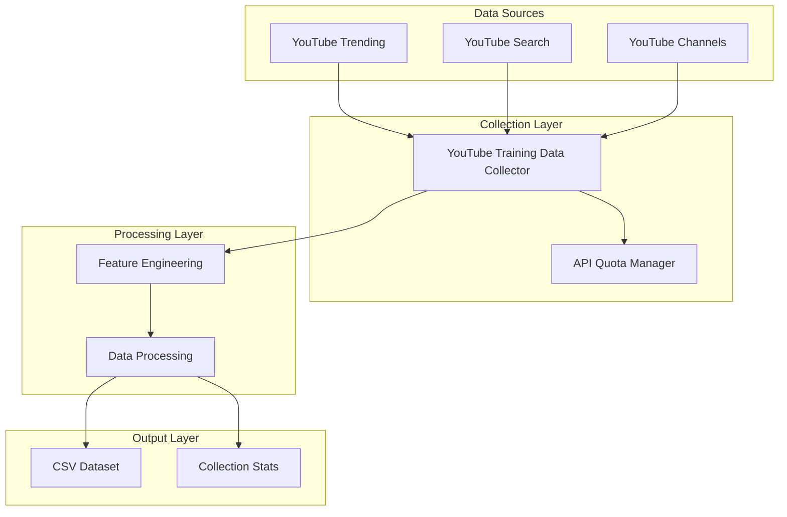

# K-Beauty AI 학습용 데이터 수집 시스템

YouTube에서 K-Beauty 관련 바이럴 콘텐츠를 수집하여 AI 모델 학습용 데이터셋을 구축하는 시스템입니다.  
**NEW**: SRS 요구사항 기반 YouTube 메가히트 탐지 및 학습 데이터셋 생성!

## 🎯 프로젝트 목표

1. **AI 학습용 데이터셋 구축**: YouTube API를 통해 K-Beauty 관련 영상 데이터를 수집하고 피처 엔지니어링을 통해 AI 모델 학습에 최적화된 CSV 데이터셋 생성
2. **메가히트 예측 모델**: View Velocity, VPV, Engagement Rate 등 파생 피처를 활용하여 바이럴 영상을 조기에 예측할 수 있는 학습 데이터 제공
3. **일별 배치 시스템**: 매일 자동으로 최신 트렌드 데이터를 수집하여 지속적으로 학습 데이터셋을 업데이트

## 🚀 빠른 시작

### 🔥 NEW: AI 학습용 데이터 수집 시스템 (권장)

SRS 요구사항 기반으로 새롭게 구현된 YouTube 메가히트 탐지 및 학습 데이터셋 구축 시스템입니다.

```bash
# 1. 환경 설정
# .env 파일에 YouTube API 키 설정
export YOUTUBE_API_KEYS="your_api_key1,your_api_key2"

# 2. 패키지 설치
pip install -r requirements.txt

# 3. 시스템 테스트
python test_training_system.py

# 4. 일별 데이터 수집 실행
python run_training_collection.py

# 5. 특정 날짜 수집
python run_training_collection.py --date 2026-01-01

# 6. 배치 수집 (여러 날짜)
python run_training_collection.py --start-date 2025-12-28 --end-date 2025-12-31
```

**주요 기능**:
- 🎯 YouTube Data API v3 기반 3가지 소스 데이터 수집
  - 거시 트렌드 (인기 급상승 차트)
  - 키워드 발굴 (Korean Skincare, K-Beauty 등)
  - 채널 성과 (주요 뷰티 인플루언서)
- ⚙️ 피처 엔지니어링 (View Velocity, VPV, Engagement Rate)
- 📊 CSV 데이터셋 생성 (UTF-8-SIG, AI 학습 최적화)
- 🔄 일별 배치 스케줄링 및 통계 리포팅

### 기존 RAG 시스템 (레거시)

기존에 구현된 Amazon 리뷰 기반 RAG 시스템도 포함되어 있습니다:

| 버전 | 비용 | 용도 | 문서 |
|------|------|------|------|
| **v1 (로컬)** | $10-30/월 | 개발, 학습 | [V1_LOCAL_DEV.md](docs/V1_LOCAL_DEV.md) |
| **v2 (최적화)** | $120-145/월 | 공모전, MVP, 5만개+ 데이터 | [V2_OPTIMIZED.md](docs/V2_OPTIMIZED.md) |
| **v3 (프로덕션)** | $700-1,000/월 | 상용 서비스 | [V3_PRODUCTION.md](docs/V3_PRODUCTION.md) |

## 🔥 AI 학습용 데이터 수집 시스템 상세

### SRS 요구사항 기반 설계

본 시스템은 사용자가 제공한 상세한 SRS(Software Requirements Specification) 요구사항을 바탕으로 설계되었습니다:

- **목표**: 미국 시장 내 K-Beauty 관련 급상승 동영상을 조기에 식별
- **3가지 데이터 소스**: 거시 트렌드, 키워드 발굴, 채널 성과 분석
- **피처 엔지니어링**: View Velocity, VPV, Engagement Rate 등 바이럴 예측 지표
- **CSV 스키마**: AI 모델 학습에 최적화된 17개 컬럼 구조

### 시스템 아키텍처



### 핵심 컴포넌트

1. **YouTube Training Data Collector** (`src/collectors/youtube_training_data_collector.py`)
   - YouTube Data API v3 통합
   - 3가지 소스 데이터 수집 (거시 트렌드, 키워드 발굴, 채널 성과)
   - API 할당량 관리 및 키 로테이션
   - 피처 엔지니어링 (View Velocity, VPV, Engagement Rate)

2. **Training System** (`src/viral_detection_system.py`)
   - 일별 배치 스케줄링
   - 데이터 품질 관리
   - CSV 데이터셋 생성 (UTF-8-SIG)
   - 수집 통계 및 리포팅

### CSV 데이터셋 스키마

생성되는 CSV 파일은 다음 17개 컬럼으로 구성됩니다:

| 컬럼명 | 타입 | 설명 |
|--------|------|------|
| `collection_date` | string | 수집 날짜 (YYYY-MM-DD) |
| `video_id` | string | YouTube 영상 ID |
| `title` | string | 영상 제목 |
| `channel_name` | string | 채널명 |
| `upload_date` | string | 업로드 날짜 (ISO format) |
| `duration_sec` | int | 영상 길이 (초) |
| `subscriber_count` | int | 채널 구독자 수 |
| `view_count` | int | 조회수 |
| `like_count` | int | 좋아요 수 |
| `comment_count` | int | 댓글 수 |
| `view_velocity` | float | 시간당 조회수 증가량 |
| `vpv_ratio` | float | 구독자 대비 조회수 비율 |
| `engagement_rate` | float | 조회수 대비 반응율 |
| `top_comments_text` | string | 상위 댓글 (파이프 구분) |
| `description_keywords` | string | 설명란 키워드 (쉼표 구분) |
| `is_trending_category` | int | 트렌딩 차트 진입 여부 (1/0) |
| `source_type` | string | 데이터 소스 타입 |

### 실행 모드

```bash
# 일별 수집 (오늘 날짜)
python run_training_collection.py

# 특정 날짜 수집
python run_training_collection.py --date 2026-01-01

# 배치 수집 (날짜 범위)
python run_training_collection.py --start-date 2025-12-28 --end-date 2025-12-31

# 시스템 테스트
python test_training_system.py
```

### 환경 설정

`.env` 파일 예시:
```bash
# YouTube Data API v3 키 (필수)
YOUTUBE_API_KEYS=your_api_key_1,your_api_key_2

# 수집 설정
COLLECTION_SCHEDULE=daily
BATCH_SIZE=100
OUTPUT_DIRECTORY=results
MIN_VIEW_COUNT=1000

# 로깅 설정
LOG_LEVEL=INFO
LOG_FILE=viral_detection.log
```

## 📊 수집 데이터

### 🔥 NEW: AI 학습용 데이터셋
- **데이터 소스**: YouTube Data API v3
- **수집 방식**: 3가지 소스 (거시 트렌드, 키워드 발굴, 채널 성과)
- **타겟 키워드**: Korean Skincare, Glass Skin, K-Beauty Routine, Tirtir, Biodance, Anua 등
- **파일 형식**: `youtube_viral_dataset_v1_{YYYYMMDD}.csv`
- **인코딩**: UTF-8-SIG (Excel 호환)
- **수집 주기**: 일별 배치 (설정 가능)

### 데이터 품질 관리
- **중복 제거**: video_id 기준 자동 중복 제거
- **데이터 검증**: 필수 필드 존재 여부 확인
- **품질 메트릭**: 트렌딩 비율, 평균 조회수, 평균 참여율 제공

## 📁 프로젝트 구조

```
.
├── 🔥 AI 학습용 데이터 수집 시스템 (메인)
│   ├── src/
│   │   ├── collectors/
│   │   │   └── youtube_training_data_collector.py  # YouTube 학습 데이터 수집기
│   │   └── viral_detection_system.py               # 메인 통합 시스템
│   ├── run_training_collection.py                  # 실행 스크립트
│   ├── test_training_system.py                     # 시스템 테스트
│   └── .env                                        # 환경 설정
│
├── 📋 스펙 및 설계
│   └── .kiro/specs/viral-detection-system/
│       ├── requirements.md                         # SRS 요구사항 명세서
│       └── design.md                              # 설계 문서
│
├── 🏗️ 인프라 (Terraform)
│   └── terraform/
│       ├── main.tf                                # Azure 인프라 정의
│       └── variables.tfvars.example               # 변수 예시
│
├── 📚 문서
│   ├── docs/guides/                               # 가이드 문서
│   ├── docs/V1_LOCAL_DEV.md                      # 기존 RAG 시스템 v1
│   ├── docs/V2_OPTIMIZED.md                      # 기존 RAG 시스템 v2
│   └── docs/V3_PRODUCTION.md                     # 기존 RAG 시스템 v3
│
└── 📊 데이터
    ├── results/                                   # AI 학습용 CSV 데이터셋
    │   └── youtube_viral_dataset_v1_YYYYMMDD.csv
    └── viral_results/                             # 기존 바이럴 감지 결과 (레거시)
```

## 🤖 사용 예시

### 🔥 AI 학습용 데이터 수집

```python
from src.viral_detection_system import YouTubeTrainingSystem, load_config_from_env

# 시스템 초기화
config = load_config_from_env()
system = YouTubeTrainingSystem(config)

# 일별 데이터 수집
stats = await system.run_daily_collection()
print(f"수집된 영상: {stats.total_videos_processed}개")
print(f"트렌딩 영상: {stats.trending_videos_count}개")
print(f"CSV 파일: {stats.csv_file_path}")

# 배치 수집 (여러 날짜)
date_range = ["2025-12-28", "2025-12-29", "2025-12-30"]
all_stats = await system.run_batch_collection(date_range)
```

### 생성된 CSV 데이터 활용

```python
import pandas as pd

# CSV 파일 로드
df = pd.read_csv("results/youtube_viral_dataset_v1_20260101.csv")

# 기본 통계
print(f"총 영상 수: {len(df)}")
print(f"트렌딩 영상 비율: {df['is_trending_category'].mean():.2%}")
print(f"평균 조회수: {df['view_count'].mean():,.0f}")
print(f"평균 참여율: {df['engagement_rate'].mean():.4f}")

# 고성과 영상 필터링
high_performance = df[
    (df['view_velocity'] > df['view_velocity'].quantile(0.9)) |
    (df['vpv_ratio'] > 2.0) |
    (df['engagement_rate'] > 0.05)
]
print(f"고성과 영상: {len(high_performance)}개")
```

## 🛠️ 기술 스택

### 🔥 AI 학습용 데이터 수집 시스템
- **API 통합**: YouTube Data API v3
- **비동기 처리**: AsyncIO, aiohttp
- **데이터 처리**: Pandas, CSV (UTF-8-SIG)
- **피처 엔지니어링**: 커스텀 알고리즘 (View Velocity, VPV, Engagement Rate)
- **아키텍처**: 모듈화된 컴포넌트 기반 설계

## 💰 비용 예상

### 🔥 AI 학습용 데이터 수집 시스템
- **YouTube API**: $0 (일일 할당량 10,000 units 내)
- **서버 운영**: $0 (로컬 실행 또는 최소 클라우드 인스턴스)
- **데이터 저장**: $0 (로컬 CSV 파일)
- **총 예상 비용**: $0/월 (API 할당량 내 사용시)

## 📈 예시 데이터 및 활용

### 🔥 생성되는 학습 데이터셋 예시
```csv
collection_date,video_id,title,channel_name,upload_date,duration_sec,subscriber_count,view_count,like_count,comment_count,view_velocity,vpv_ratio,engagement_rate,top_comments_text,description_keywords,is_trending_category,source_type
2026-01-01,dQw4w9WgXcQ,Korean Glass Skin Routine,Beauty Guru,2025-12-31T10:00:00Z,420,150000,500000,25000,1200,20833.33,3.33,0.0524,love this routine|where to buy|amazing results,korean skincare glass skin routine,1,macro_trend
```

### AI 모델 학습 활용 방안
1. **바이럴 예측 모델**: `is_trending_category`를 타겟으로 하는 분류 모델
2. **조회수 예측**: `view_count`를 예측하는 회귀 모델
3. **참여율 분석**: `engagement_rate` 기반 콘텐츠 품질 평가
4. **트렌드 분석**: 시계열 데이터로 트렌드 변화 패턴 학습

## 📝 상세 문서

### 🔥 AI 학습용 데이터 수집 시스템
- **SRS 요구사항 명세**: [.kiro/specs/viral-detection-system/requirements.md](.kiro/specs/viral-detection-system/requirements.md)
- **설계 문서**: [.kiro/specs/viral-detection-system/design.md](.kiro/specs/viral-detection-system/design.md)
- **시스템 테스트**: `test_training_system.py`
- **실행 가이드**: `run_training_collection.py --help`

## 🎯 공모전 어필 포인트

### 🔥 NEW: AI 학습용 데이터 수집 시스템
1. ✅ **SRS 기반 설계**: 상세한 요구사항 명세서를 바탕으로 한 체계적 개발
2. ✅ **실시간 트렌드 데이터**: YouTube API를 통한 최신 K-Beauty 트렌드 수집
3. ✅ **피처 엔지니어링**: View Velocity, VPV, Engagement Rate 등 바이럴 예측 지표
4. ✅ **AI 학습 최적화**: 머신러닝 모델 학습에 최적화된 CSV 데이터셋 생성
5. ✅ **확장 가능성**: 모듈화된 구조로 다양한 플랫폼 확장 가능

## 📊 프로젝트 진행률

- ✅ Phase 1: 기존 RAG 시스템 (100%)
- ✅ **🔥 Phase 2: AI 학습용 데이터 수집 시스템 (100%)**
- 🔄 Phase 3: AI 모델 학습 및 예측 (0%)
- 🔄 Phase 4: 실시간 모니터링 대시보드 (0%)

**전체 진행률**: 50% (AI 학습용 데이터 수집 시스템 완성으로 대폭 향상!)

---

**프로젝트**: K-Beauty AI 학습용 데이터 수집 시스템  
**최신 업데이트**: 2026-01-01 - YouTube 메가히트 탐지 및 학습 데이터셋 구축 시스템 완성  
**GitHub**: https://github.com/Gosorasora/kbeauty-insights-scraper

### 기존 RAG 시스템 문서 (레거시)
- **v1 (로컬 개발)**: [V1_LOCAL_DEV.md](docs/V1_LOCAL_DEV.md)
- **v2 (최적화)**: [V2_OPTIMIZED.md](docs/V2_OPTIMIZED.md)
- **v3 (프로덕션)**: [V3_PRODUCTION.md](docs/V3_PRODUCTION.md)
